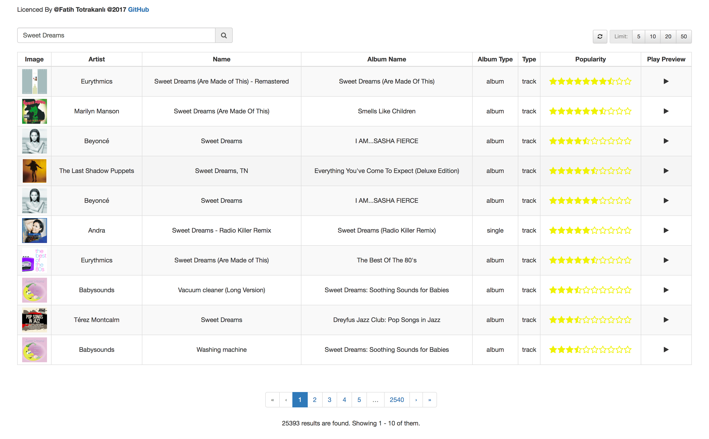

# SpringBoot - Spotify API - ReactJS
###### This is a web application developed using Spotify API with React.
###### There are two modules in the project.
###### spotify-api-server is a Spring Boot application with using Spotify Search API.
###### spotify-api-ui is a ReactJS application.



## spotify-api-server

For use Spotify API you need to take authorization token from Spotify.
You can take authorization token from [Here](https://developer.spotify.com/web-api/console/get-search-item/)

In the ```
       application.yml
       ```, you can set token here.

This token looks like this;
```
token: "BQDYNZJKRPp271pXIiMRrRbx77TSo5BuQKMZeBXFlD9FwwRP4VjbkKxTfwKOvZSS_kZCQYSGK9QA7dKFl63tXo4taPItG6ya0AL-7L2zvOlI8IDrRwoF4yEws8AJjXtf2-PKJqj3hmaz765w_A"
```

The project is a Spring Boot project. For this reason, you can run the Application class by running it.

## spotify-api-ui

###### This module uses React and React-Bootstrap. Includes paging and limiting features about Spotify response.

In the project folder ```
                      $ cd spotify-api-ui
                      ``` use the following command.
```
$ npm install
```

then

```
$ npm start
```

and project will start at ```
                          http://127.0.0.1:3000
                          ```

## License

The MIT License (MIT) Copyright (c) 2017 Fatih Totrakanlı